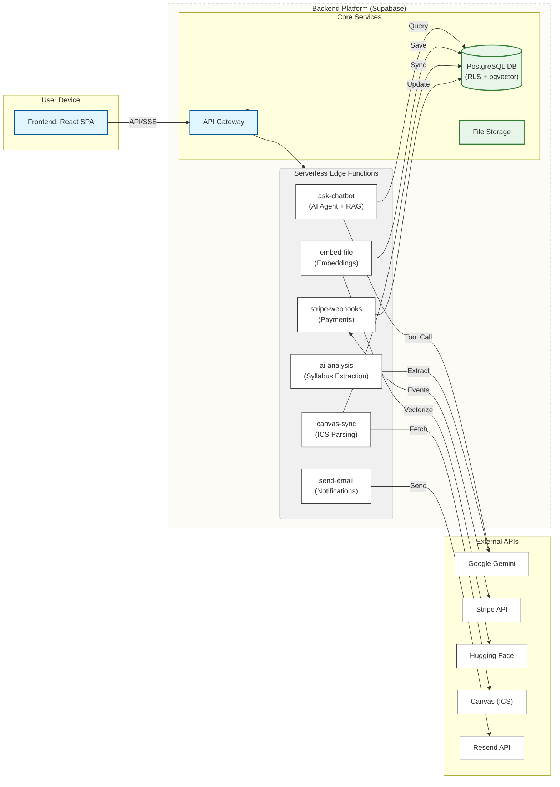

# ScheduleBud: AI-Powered Academic Management Platform

[](https://schedulebud.app/) [](https://reactjs.org/) [](https://www.typescriptlang.org/) [](https://supabase.com/) [](https://deepmind.google/technologies/gemini/)

**Live Application:** [**https://schedulebud.app**](https://schedulebud.app/)

## Project Overview

ScheduleBud is an AI-native, full-stack productivity platform designed to help students manage their academic lives. It solves the problem of fragmented academic tools by syncing Canvas LMS assignments from `.ics` calendar links, parsing syllabi with AI, providing an intelligent AI agent with RAG capabilities and task management through natural language, and offering real-time task management in a single, intuitive interface. ScheduleBud is built for the modern student who needs to stay organized and efficient.

## Live Demo

A live video demo can be found here: [ScheduleBud Demo](https://youtu.be/TEmODMrIAvg)

## Tech Stack

| Frontend | Backend | AI/ML | Infrastructure | Payments | Testing |
|---|---|---|---|---|---|
|  |  |  |  |  |  |
|  |  |  | | | |
|  |  |  | | | |

## High-Level System Design

My design for ScheduleBud was driven by five core principles, essential for a solo engineer building a production-ready application:

1.  **Serverless-First:** Eliminate infrastructure management by using serverless functions for all custom backend logic, ensuring automatic scaling and reducing operational overhead.
2.  **Maximize Velocity with Managed Services:** Leverage a Backend-as-a-Service (Supabase) for commodity components like user auth and a basic CRUD API, allowing me to focus engineering effort on unique, value-adding features.
3.  **Security at the Core:** Implement security at the lowest possible layer (the database) using Row-Level Security (RLS) and create secure boundaries for all external service interactions.
4.  **Resilience and Fallbacks:** Acknowledge that external services and complex processes can fail. The system must be designed to be self-healing, handle errors gracefully, and use fallback mechanisms wherever possible.
5.  **Cost Optimization:** Design the system to be intelligent about resource usage, especially expensive AI API calls, by implementing smart routing and caching.

Based on these principles, I architected ScheduleBud as a decoupled, multi-tier system. It consists of a React SPA frontend, a central BaaS platform, and a suite of specialized serverless microservices that handle complex, asynchronous tasks.



## Key Architectural Features & Implementations

### 1. The AI Agent with RAG Pipeline & Tool Calling (Smart Assistant)
**Feature:** An intelligent AI agent that combines retrieval-augmented generation (RAG) for answering course-specific questions with function calling capabilities for task management. Users can ask questions about their course materials AND execute CRUD operations on their tasks through natural language (e.g., "Create a Biology homework task due on December 25", "Update my quiz to be due next week", "Delete all completed tasks").

**Technical Implementation:** I architected a **stateless, streaming AI agent** that intelligently routes queries and executes tools when needed. The system uses a `classifyQueryIntent` algorithm to route queries into 4 categories (`document_search`, `task_related`, `general_knowledge`, `conversational`) BEFORE making expensive API calls. This smart routing means **~70-80% of queries skip RAG entirely**, avoiding unnecessary HuggingFace embedding API calls and PostgreSQL vector searches.

**Key Capabilities:**

1. **RAG Pipeline for Document Questions**: Only queries explicitly about course materials trigger document retrieval via vector similarity search (pgvector). The system is self-healing: if a document search fails because files aren't processed, it auto-triggers the embedding function and retries.

2. **Function Calling for Task Management**: The AI can execute 6 CRUD operations through Gemini's tool calling: `create_task`, `update_task`, `delete_task`, `batch_update_tasks`, `search_tasks`, and `search_classes`. The system implements **two-phase execution** for destructive actions (delete, batch operations) - requiring user confirmation before execution, while non-destructive actions execute immediately.

3. **Search-to-ID Resolution**: The AI uses human-friendly search terms (task names like "homework", class names like "Biology"), and the backend automatically resolves them to database IDs through fuzzy matching. Missing classes are auto-created with an `istaskclass` flag to separate AI-managed entities from user-created entities.

4. **Streaming UX**: Server-Sent Events (SSE) deliver real-time responses with a smooth scrolling buffer that provides a typewriter effect at 60 FPS, making the interaction feel responsive even during long responses.

**Code Snippet (Query Intent Classification for Cost Optimization):**
```typescript
function classifyQueryIntent(
  query: string,
  hasClassContext: boolean,
  hasConversationHistory: boolean
): 'document_search' | 'task_related' | 'general_knowledge' | 'conversational' {
  const normalizedQuery = query.toLowerCase().trim();

  // Indicator keywords for different categories
  const documentIndicators = ['syllabus', 'lecture', 'reading', 'according to'];
  const taskIndicators = ['create task', 'update task', 'delete task', 'due', 'deadline'];

  // Priority scoring system to determine the most likely intent
  let documentScore = 0;
  let taskScore = 0;

  documentIndicators.forEach(ind => normalizedQuery.includes(ind) ? documentScore += 2 : null);
  taskIndicators.forEach(ind => normalizedQuery.includes(ind) ? taskScore += 2 : null);

  if (hasClassContext && documentScore === 0) documentScore += 1;
  if (hasConversationHistory && normalizedQuery.length < 30) return 'conversational';

  // Determine the highest score to select the query type
  const maxScore = Math.max(documentScore, taskScore);

  if (maxScore < 2) {
    if (hasClassContext) return 'document_search';
    return 'general_knowledge';
  }

  return documentScore > taskScore ? 'document_search' : 'task_related';
}
```

### 2. The Secure Data Ingestion & Embedding Pipeline
**Feature:** A secure pipeline to process user-uploaded syllabi (PDFs/DOCX), extract their content, and transform them into searchable vector embeddings.

**Technical Implementation:** This serverless function is designed for resilience and security. It uses a two-stage parsing system, trying a fast library first and then falling back to the more robust `pdfjs-dist` to maximize success. All extracted text is sanitized and validated against security patterns before processing. To ensure data integrity, the function is **idempotent**, deleting any stale embeddings for a file before generating new ones.

### 3. The Event-Driven Payments System
**Feature:** A complete subscription management system integrating Stripe checkout, billing portal, and webhook-based payment synchronization.

**Technical Implementation:** I designed a three-part serverless payment architecture:

1. **Checkout Session Creation (`create-checkout-session`)**: Securely generates Stripe checkout sessions server-side, preventing client-side price manipulation and ensuring proper subscription tier validation.

2. **Billing Portal Access (`create-portal-session`)**: Provides authenticated users with secure access to Stripe's customer portal for managing subscriptions, payment methods, and billing history.

3. **Webhook Event Processing (`stripe-webhook`)**: An asynchronous, event-driven system using Stripe webhooks. This serverless function acts as a secure endpoint that **cryptographically verifies webhook signatures** before processing events. It operates as a state machine, listening for events like `invoice.payment_succeeded`, `invoice.payment_failed`, and `customer.subscription.deleted`, then updating the user's `subscription_status` in the PostgreSQL database to maintain data integrity between ScheduleBud and Stripe.

All three functions enforce strict security measures, including signature verification, authenticated user validation, and server-side payment processing to prevent tampering.

### 4. The Canvas LMS Integration System (ICS Calendar Parsing)
**Feature:** Seamless synchronization of Canvas LMS assignments by parsing ICS calendar feeds, automatically importing due dates, assignment names, and course information into ScheduleBud.

**Technical Implementation:** I built a serverless edge function that fetches and parses Canvas ICS calendar feeds server-side, completely bypassing CORS restrictions that plague client-side implementations. The system implements intelligent duplicate detection using Canvas UIDs to ensure assignments aren't duplicated on subsequent syncs. It includes robust error handling with exponential backoff retries and supports bulk assignment processing for courses with heavy assignment loads. The parser extracts course codes, assignment details, and due dates, automatically creating tasks with proper class associations and Canvas metadata for seamless integration.

### 5. The AI-Powered Document Analysis Engine
**Feature:** Intelligent extraction of structured academic metadata from user-uploaded documents, automatically detecting courses, assignments, due dates, and academic requirements from syllabi and course materials.

**Technical Implementation:** I designed a specialized serverless edge function that leverages Google Gemini 2.0 Flash's structured output capabilities to parse academic documents and extract actionable task data. The system implements sophisticated JSON truncation recovery algorithms and domain-specific parsing for academic terminology (especially nursing/healthcare: ATI, HESI, clinical engagement). It handles complex date extraction from weekly ranges, checkbox assignments, and various academic formats, then stores the structured extraction results in PostgreSQL for integration with the task management system. This is separate from the embedding pipeline and focuses purely on extracting structured academic metadata rather than creating searchable vectors.

## Key Challenge & Solution: Multi-Tenant Data Security

**Challenge:** One of the biggest challenges was designing a system where multiple users could store their personal academic data with the absolute guarantee that their information would remain private. A simple mistake in a query could potentially expose one user's data to another.

**Solution:** I solved this by making data ownership a core principle of the database schema and enforcing security at the database level with **Row-Level Security (RLS)**. Every table containing user-generated content has a `user_id` column that links to the `auth.users` table.

By implementing RLS policies on all relevant tables, I created a fundamental security model that cannot be bypassed by application-level code. This approach ensures that even if there were a bug in an API call, the database itself would still prevent unauthorized data access, effectively creating a powerful security backstop.

**Code Snippet (PostgreSQL RLS Policy):**
```sql
-- Enable Row-Level Security on the 'tasks' table
ALTER TABLE public.tasks ENABLE ROW LEVEL SECURITY;

-- Create a policy that allows users to see only their own tasks
CREATE POLICY "Users can view their own tasks"
ON public.tasks FOR SELECT
USING (auth.uid() = user_id);

-- Create a policy that allows users to insert tasks for themselves
CREATE POLICY "Users can create their own tasks"
ON public.tasks FOR INSERT
WITH CHECK (auth.uid() = user_id);
```
