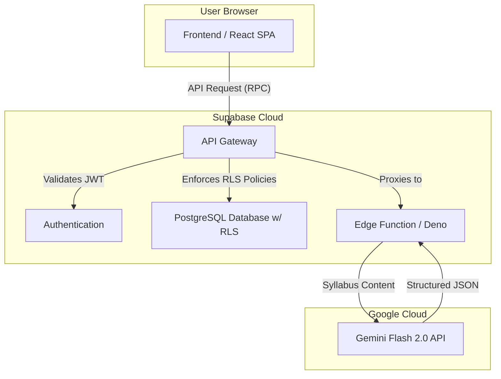

# ScheduleBud: AI-Powered Academic Management Platform

[](https://schedulebud.app/) [](https://reactjs.org/) [](https://www.typescriptlang.org/) [](https://supabase.com/) [](https://deepmind.google/technologies/gemini/)

**Live Application:** [**https://schedulebud.app**](https://schedulebud.app/)

## Project Overview

ScheduleBud is an AI-native, full-stack productivity platform designed to help students manage their academic lives. It solves the problem of fragmented academic tools by integrating Canvas LMS data, AI-powered syllabus parsing, and real-time task management into a single, intuitive interface. ScheduleBud is built for the modern student who needs to stay organized and efficient.

## Live Demo

A live video demo can be found here: [ScheduleBud Demo](https://youtu.be/zztlhaFNqRM?si=7mF0thwUzSvvUwfq)

## Tech Stack

| Frontend | Backend | AI/ML | Infrastructure | Payments | Testing |
|---|---|---|---|---|---|
|  |  |  |  |  |  |
|  |  |  | | |  |
|  |  |  | | | |

## System Architecture

The system is a modern SPA with a decoupled frontend and backend, built on Supabase for the database, authentication, and serverless Edge Functions. For AI features, the Edge Functions securely call the Google Gemini API.



## Key Features & Technical Deep Dive

### 1. AI-Powered Syllabus Parsing

**Feature:** Saves students hours of manual data entry by automatically parsing PDF/DOCX syllabi, extracting all assignments and exams, and populating their calendar in seconds.

**Technical Implementation:** This is powered by a Supabase Edge Function written in TypeScript. On upload, the file's text content is sent to the function. It then calls the Google Gemini Flash 2.0 model with a carefully engineered prompt to analyze the text and return a structured JSON object of tasks. This JSON is then used to populate the user's calendar with over 95% accuracy.

**Code Snippet (Core AI Logic):**
This snippet shows the robust, focused function for processing syllabus text with the Gemini API.

```typescript
// backend/supabase/functions/shared/ai-parser.ts

import { GoogleGenerativeAI } from "https://esm.sh/@google/generative-ai";

// Initialize the AI model once for efficiency
const genAI = new GoogleGenerativeAI(Deno.env.get("GEMINI_API_KEY"));
const model = genAI.getGenerativeModel({ model: "gemini-1.5-flash-latest" });

interface Task {
  task: string;
  dueDate: string; // YYYY-MM-DD format
  type: "Assignment" | "Exam" | "Quiz" | "Other";
}

/**
 * Parses raw text from a syllabus to extract structured academic tasks.
 * @param syllabusText The raw text content of the syllabus.
 * @returns A promise that resolves to an array of structured Task objects.
 */
export async function parseSyllabus(syllabusText: string): Promise<Task[]> {
  const prompt = `
    You are an academic assistant. Analyze the following syllabus text and extract all assignments, exams, and deadlines.
    Strictly return only a valid JSON array of objects with this structure:
    { "task": "Assignment Name", "dueDate": "YYYY-MM-DD", "type": "Assignment/Exam/Quiz/Other" }
    Do not include any explanatory text, markdown, or any characters before or after the JSON array.
  `;

  try {
    const result = await model.generateContent([prompt, syllabusText]);
    const response = await result.response;
    const jsonText = response.text();
    
    // The robust prompt ensures the response should be clean JSON
    return JSON.parse(jsonText) as Task[];
  } catch (error) {
    console.error("Error parsing syllabus with Gemini API:", error);
    // Return an empty array or throw a custom error for the calling function to handle
    return [];
  }
}
```

### 2. Multi-Tenant Data Privacy with Row-Level Security (RLS)

**Feature:** ScheduleBud is a multi-tenant application where users store sensitive academic data. It is critical that users can only access their own information.

**Technical Implementation:** To ensure strict data privacy, I designed the PostgreSQL schema with user ownership in mind and implemented Supabase's Row-Level Security (RLS). Every table that contains user data has an RLS policy that prevents users from accessing data that does not belong to them. This is enforced at the database level, providing a robust security guarantee that cannot be bypassed by client-side code.

**Code Snippet (PostgreSQL RLS Policy):**
This SQL snippet shows a typical RLS policy for the `tasks` table. It ensures that a user can only perform operations on tasks that they own.

```sql
-- Enable Row-Level Security on the 'tasks' table
ALTER TABLE public.tasks ENABLE ROW LEVEL SECURITY;

-- Create a policy that allows users to see only their own tasks
CREATE POLICY "Users can view their own tasks"
ON public.tasks FOR SELECT
USING (auth.uid() = user_id);

-- Create a policy that allows users to insert tasks for themselves
CREATE POLICY "Users can create their own tasks"
ON public.tasks FOR INSERT
WITH CHECK (auth.uid() = user_id);

-- Create a policy that allows users to update their own tasks
CREATE POLICY "Users can update their own tasks"
ON public.tasks FOR UPDATE
USING (auth.uid() = user_id);

-- Create a policy that allows users to delete their own tasks
CREATE POLICY "Users can delete their own tasks"
ON public.tasks FOR DELETE
USING (auth.uid() = user_id);
```

## Challenges & Solutions

**Challenge: Ensuring data privacy for a multi-tenant application.**

One of the biggest challenges was designing a system where multiple users could store their personal academic data with the absolute guarantee that their information would remain private. A simple mistake in a query could potentially expose one user's data to another.

**Solution: A combination of schema design and database-level security.**

I solved this by making data ownership a core principle of the database schema. Every table containing user-generated content has a `user_id` column that links to the `auth.users` table provided by Supabase.

Then, I implemented Row-Level Security (RLS) policies on all relevant tables. As shown in the code snippet above, these policies are not just an afterthought; they are a fundamental part of the security model. By enforcing data access rules at the database level, RLS provides a much stronger security guarantee than application-level checks. This approach ensures that even if there were a bug in the application code, the database would still prevent unauthorized data access, effectively creating a powerful security backstop.
