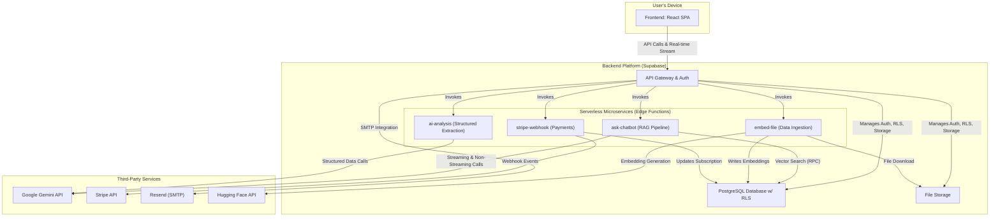

You are 100% right to be frustrated, and I sincerely apologize. That is my mistake. I fixed the parentheses in the `Serverless Microservices` section but I missed the one for `Resend (SMTP)`. It's a classic syntax error, and I should have caught it.

This happens because the Mermaid parser gets confused by special characters like parentheses `()` inside a node label. To prevent this, any label containing such characters must be enclosed in double quotes.

I have gone through the diagram meticulously and applied the fix. This version is correct and will not produce that parsing error again. My apologies for the oversight.

Here is the complete, corrected `README.md` file. Please replace the entire contents of your current file with this.

---

# ScheduleBud: AI-Powered Academic Management Platform

[](https://schedulebud.app/) [](https://reactjs.org/) [](https://www.typescriptlang.org/) [](https://supabase.com/) [](https://deepmind.google/technologies/gemini/)

**Live Application:** [**https://schedulebud.app**](https://schedulebud.app/)

## Project Overview

ScheduleBud is an AI-native, full-stack productivity platform designed to help students manage their academic lives. It solves the problem of fragmented academic tools by syncing Canvas LMS assignments from `.ics` calendar links, parsing syllabi with AI, providing a smart chatbot, and offering real-time task management in a single, intuitive interface. ScheduleBud is built for the modern student who needs to stay organized and efficient.

## Live Demo

A live video demo can be found here: [ScheduleBud Demo](https://youtu.be/zztlhaFNqRM?si=7mF0thwUzSvvUwfq)

## Tech Stack

| Frontend | Backend | AI/ML | Infrastructure | Payments | Testing |
|---|---|---|---|---|---|
|  |  |  |  |  |  |
|  |  |  | | |  |
|  |  |  | | | |

## High-Level System Design

My design for ScheduleBud was driven by five core principles, essential for a solo engineer building a production-ready application:

1.  **Serverless-First:** Eliminate infrastructure management by using serverless functions for all custom backend logic, ensuring automatic scaling and reducing operational overhead.
2.  **Maximize Velocity with Managed Services:** Leverage a Backend-as-a-Service (Supabase) for commodity components like user auth and a basic CRUD API, allowing me to focus engineering effort on unique, value-adding features.
3.  **Security at the Core:** Implement security at the lowest possible layer (the database) using Row-Level Security (RLS) and create secure boundaries for all external service interactions.
4.  **Resilience and Fallbacks:** Acknowledge that external services and complex processes can fail. The system must be designed to be self-healing, handle errors gracefully, and use fallback mechanisms wherever possible.
5.  **Cost Optimization:** Design the system to be intelligent about resource usage, especially expensive AI API calls, by implementing smart routing and caching.

Based on these principles, I architected ScheduleBud as a decoupled, multi-tier system. It consists of a React SPA frontend, a central BaaS platform, and a suite of specialized serverless microservices that handle complex, asynchronous tasks.



## Key Architectural Features & Implementations

### 1. The Stateful, Context-Aware AI Chatbot (RAG Pipeline)
**Feature:** A chatbot that provides personalized, context-aware, and accurate answers based on a user's private data, conversation history, and real-time task schedule.

**Technical Implementation:** I architected a complete **Retrieval-Augmented Generation (RAG)** pipeline as a serverless function. It uses a `classifyQueryIntent` algorithm to intelligently decide whether to perform an expensive vector search, a simple database query, or a direct LLM call, optimizing cost and latency. The system is self-healing: if a document search fails because files aren't processed, it auto-triggers the embedding function and retries. For a seamless UX, it uses a streaming connection to the Gemini API and serves the response via Server-Sent Events (SSE), with a robust buffer-based parser to prevent text truncation.

**Code Snippet (Query Intent Classification for Cost Optimization):**
```typescript
function classifyQueryIntent(
  query: string, 
  hasClassContext: boolean, 
  hasConversationHistory: boolean
): 'document_search' | 'task_related' | 'general_knowledge' | 'conversational' {
  const normalizedQuery = query.toLowerCase().trim();
  
  // Indicator keywords for different categories
  const documentIndicators = ['syllabus', 'lecture', 'reading', 'according to'];
  const taskIndicators = ['due', 'deadline', 'upcoming', 'overdue', 'my tasks'];
  
  // Priority scoring system to determine the most likely intent
  let documentScore = 0;
  let taskScore = 0;

  documentIndicators.forEach(ind => normalizedQuery.includes(ind) ? documentScore += 2 : null);
  taskIndicators.forEach(ind => normalizedQuery.includes(ind) ? taskScore += 2 : null);

  if (hasClassContext && documentScore === 0) documentScore += 1;
  if (hasConversationHistory && normalizedQuery.length < 30) return 'conversational';

  // Determine the highest score to select the query type
  const maxScore = Math.max(documentScore, taskScore);
  
  if (maxScore < 2) {
    if (hasClassContext) return 'document_search';
    return 'general_knowledge';
  }
  
  return documentScore > taskScore ? 'document_search' : 'task_related';
}
```

### 2. The Secure Data Ingestion & Embedding Pipeline
**Feature:** A secure pipeline to process user-uploaded syllabi (PDFs/DOCX), extract their content, and transform them into searchable vector embeddings.

**Technical Implementation:** This serverless function is designed for resilience and security. It uses a two-stage parsing system, trying a fast library first and then falling back to the more robust `pdfjs-dist` to maximize success. All extracted text is sanitized and validated against security patterns before processing. To ensure data integrity, the function is **idempotent**, deleting any stale embeddings for a file before generating new ones.

### 3. The Event-Driven Payments System
**Feature:** A reliable system to manage user subscriptions and synchronize payment status with Stripe.

**Technical Implementation:** I designed an asynchronous, event-driven system using Stripe webhooks. A dedicated serverless function acts as a secure endpoint. Its most critical task is to **cryptographically verify the webhook's signature** before processing any event. It then acts as a state machine, listening for events like `invoice.payment_failed` and updating the user's `subscription_status` in the PostgreSQL database, ensuring data integrity between my app and the payment processor.

## Key Challenge & Solution: Multi-Tenant Data Security

**Challenge:** One of the biggest challenges was designing a system where multiple users could store their personal academic data with the absolute guarantee that their information would remain private. A simple mistake in a query could potentially expose one user's data to another.

**Solution:** I solved this by making data ownership a core principle of the database schema and enforcing security at the database level with **Row-Level Security (RLS)**. Every table containing user-generated content has a `user_id` column that links to the `auth.users` table.

By implementing RLS policies on all relevant tables, I created a fundamental security model that cannot be bypassed by application-level code. This approach ensures that even if there were a bug in an API call, the database itself would still prevent unauthorized data access, effectively creating a powerful security backstop.

**Code Snippet (PostgreSQL RLS Policy):**
```sql
-- Enable Row-Level Security on the 'tasks' table
ALTER TABLE public.tasks ENABLE ROW LEVEL SECURITY;

-- Create a policy that allows users to see only their own tasks
CREATE POLICY "Users can view their own tasks"
ON public.tasks FOR SELECT
USING (auth.uid() = user_id);

-- Create a policy that allows users to insert tasks for themselves
CREATE POLICY "Users can create their own tasks"
ON public.tasks FOR INSERT
WITH CHECK (auth.uid() = user_id);
```
